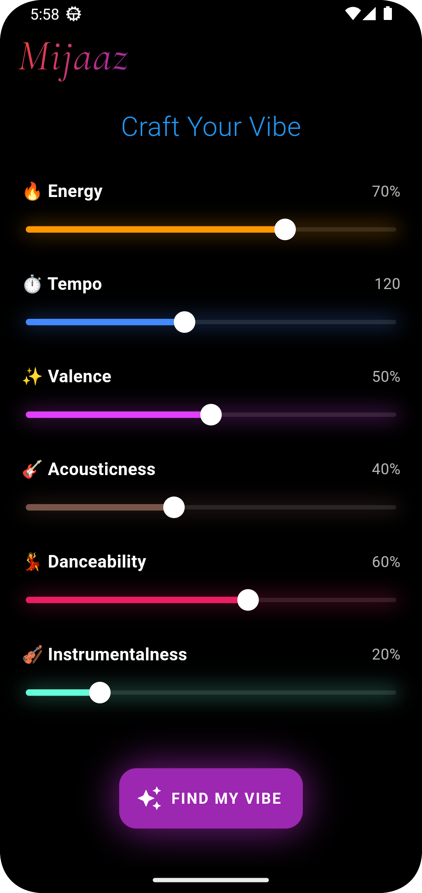
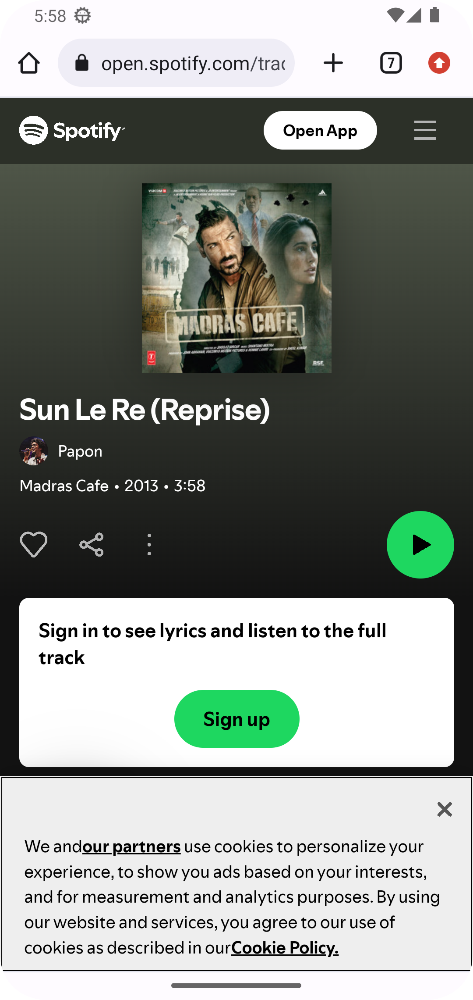

# Mijaaz-App-Showcase
## AI-Powered Offline Spotify Music Recommender
Mijaaz is a cutting-edge music recommendation Android application built with Flutter. It leverages a custom-trained Artificial Neural Network (ANN) to provide personalized song suggestions for Pakistani and Indian music listeners.

## App Showcase
#### Check out the interface and the seamless offline prediction flow:

| Splash Screen | Craft Your Vibe | Recommended | Spotify Integration |
| :---: | :---: | :---: | :---: |
|  |  |  |  |

## The "Offline-First" AI Experience
Unlike most recommendation systems that rely on heavy cloud APIs, Mijaaz works 100% offline.

- On-Device Inference: The ANN model is integrated directly into the app using TensorFlow Lite.

- Smart Loading: During the Splash Screen, the app pre-loads the ANN model into the system RAM. This ensures that once the app opens, predictions are instantaneous.

- No Internet Required: Since the model and the processed dataset (Spotify tracks optimized for Desi music) are built-in, users get recommendations anywhere, anytime.

## Key Features
- Custom ANN Model: Trained on a  Spotify dataset, specifically filtered for South Asian (Pak/Ind) musical characteristics.

- Mood & Energy Analysis: Predicts the perfect track based on user-defined energy levels, danceability, and mood and some others.

- Privacy Centric: No data leaves your device. All computations happen locally.

- High Performance: Optimized RAM management during the splash screen for a lag-free experience.

## Watch the Demo
Video is Also Given In the Repo
(https://github.com/MubashirShafique/Mijaaz-App-Showcase/releases/tag/video_off_App)

## Technical Tech Stack
- Mobile Framework: Flutter (Dart)

- Machine Learning: TensorFlow Lite (TFLite), Keras, Python

- Data Processing: Scikit-learn (StandardScaler), Pandas

- Dataset: Spotify Tracks (Curated for Pakistan & India)

## Source Code & Privacy
The core ANN architecture and the Flutter source code are kept in a Private Repository for intellectual property protection.
